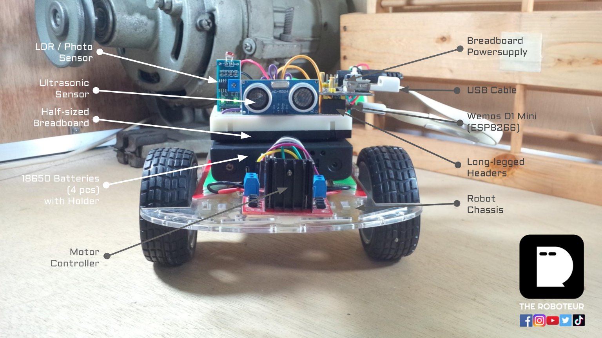
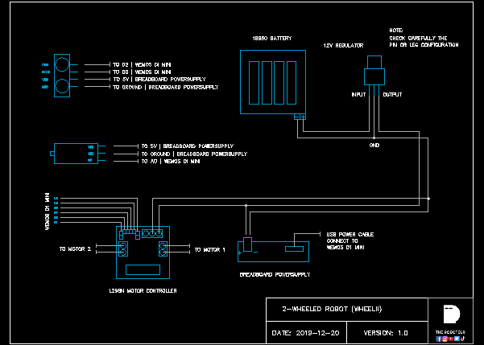

# Robot Wheelii
* An easy to build wheeled robot framework.
* Not permanently fastened, hence the hardware components are reusable.

## Features
* Smartphone Controlled
* Over-The-Air Update
* Code Design Pattern Included

## How It Works 
* Here's the link >> https://youtu.be/QHAiQ2GTEBQ

## Quick Start
1. Setup The ESP8266
    * Download Arduino IDE: https://www.arduino.cc/en/Main/Software
    * Open Arduino IDE and click: File -> Preferences -> Additional Boards Manager --> Paste this     link: https://arduino.esp8266.com/stable/package_esp8266com_index.json
    * Setup the board: Go to Tools -> Board -> Board Manager -> search ESP8266 Community, then click install
    * Select the ESP8266 board: Tools -> Board -> NodeMCU 1.0 (ESP12E Module)
    * Select the PORT: Tools -> PORT -> USB0 (or anything that works)
    * Upload the Code: Sketch -> Upload (There should be no error. If there is, it is mostly about user permissions. Message me if you can't go through this.)
2. Upload the code guardee.ino
3. Find the IP Address from the Arduino IDE Serial Monitor. 
4. Copy and paste the IP Address in the browser and start from there

## Bill Of Materials
1. Wemos D1 Mini (ESP8266) x 1  = $5.00 approx.
2. Ultrasonic Sensor x 1  = $2.00 approx.
3. Two DC Motors and Chassis Set = $6.00 approx.
4. 18650 Battery Holder x 4 slots = $2.00 approx.
6. Solid Wires #22 x 3ft. = $1.00 approx.
7. Jumper Wires male/female x 6 = $1.00 approx. 
8. USB Cable x 1 = $2.00
9. Half-sized breadboard x 1 = $2.00 
10. Long-legged Headers x 3 = $2.00
11. Breadboard Powersupply x 1 = $2.00

## Robot Construction

## Wiring Connection

* There's a DWG file as well. You can check the folders. 

## Demo Video
* Here's the link >> https://youtu.be/QHAiQ2GTEBQ

## Additional Notes
* ENA and ENB refers to the speed of each motors.

## Feel Free To Direct Message
* Facebook: https://facebook.com/TheRoboteur
* Instagram: https://instagram.com/the_roboteur
